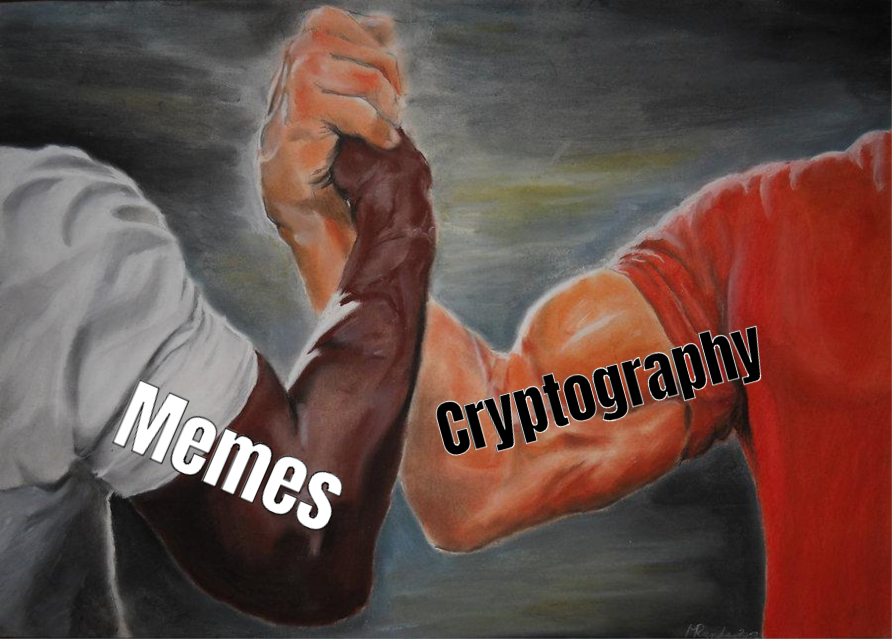

# 🌀 MemeCrypt 🌀

**Memes as Cryptography**

MemeCrypt is a Python tool that transforms your messages into cryptic, context-rich memes using the magic of LLMs (currently only gpt-4o-mini).


## 📚 The Theory: Memes Are Encryption

Memes aren’t just for humor—they're a form of **encryption**. Every meme carries **contextual keys**; cultural, social, or personal; understood by those in the know. When you share a meme, you're encoding information within a visual and textual format, and only those with the right **contextual entropy** can fully decode its meaning. This aligns with the core ideas of **information theory**, where shared context between sender and receiver determines how much information can be conveyed.

For a deeper dive into this theory, check out the [attached paper](paper.md).

---


(meme assembled in http://www.dingboard.com)

---

## 🚀 MemeCrypt: Encrypting Messages in Memes

MemeCrypt takes this concept further by automating the **cryptographic potential of memes** using AI. With MemeCrypt, you can convert your messages into memes, embedding hidden meanings that only specific audiences can decode.

### 🔑 Features:

- **AI-Powered Message Encryption**: OpenAI's GPT-4o-mini generates a unique key for every message, embedding it into meme captions.
- **On-Demand Meme Template Selection**: Templates are dynamically downloaded only when needed, saving resources.
- **Streaming Generation**: Real-time generation of captions and meme templates.
- **Memetic Communication**: Transform standard messages into cryptic, context-rich memes designed for select audiences.

## 🛠 Installation

1. **Clone the Repository**
    ```bash
    git clone https://github.com/bardia323/MemeCrypt.git
    cd memecryptor
    ```

2. **Install Dependencies**
    ```bash
    pip install -r requirements.txt
    ```

3. **Configure Environment Variables**
    - Create a `.env` file in the root directory:
        ```bash
        touch .env
        ```
    - Add your OpenAI API key:
        ```env
        OPENAI_API_KEY=your_openai_api_key_here
        ```

## 🎯 Usage

1. **Run the Meme Generator**
    ```bash
    python meme_generator.py
    ```

2. **Input Your Message**
    ```
    Enter the message you want to encode in the meme: Final exams are overwhelming this semester.
    ```

3. **Receive Your Meme**
    - Watch as the meme is generated in real-time.
    - Your personalized meme template and caption will appear in the `generated_memes/` folder.

## 📸 Sample Output
### (meme assembled in dingboard.com)


*Your secret message, now an encrypted meme!*

## 🧠 How MemeCrypt Works

1. **Message Input**: You provide the message you want to encrypt.
2. **Contextual Key Generation**: GPT-4 generates a cryptographic key based on contextual cues from your message.
3. **Meme Template Selection**: The AI selects a meme template that best aligns with the hidden context.
4. **Caption Creation**: The captions, embedding the message and context, are generated in real-time.
5. **Meme Creation**: A fully formed, contextually encrypted meme is produced, ready for selective sharing.

## 📜 License

GNU General Public License v2.0 © [Bardia](https://github.com/bardia323)

---

🔗 [Follow Me on GitHub](https://github.com/bardia323) | 📧 [Contact](mailto:bardia.shahrestani@mail.mcgill.ca)
